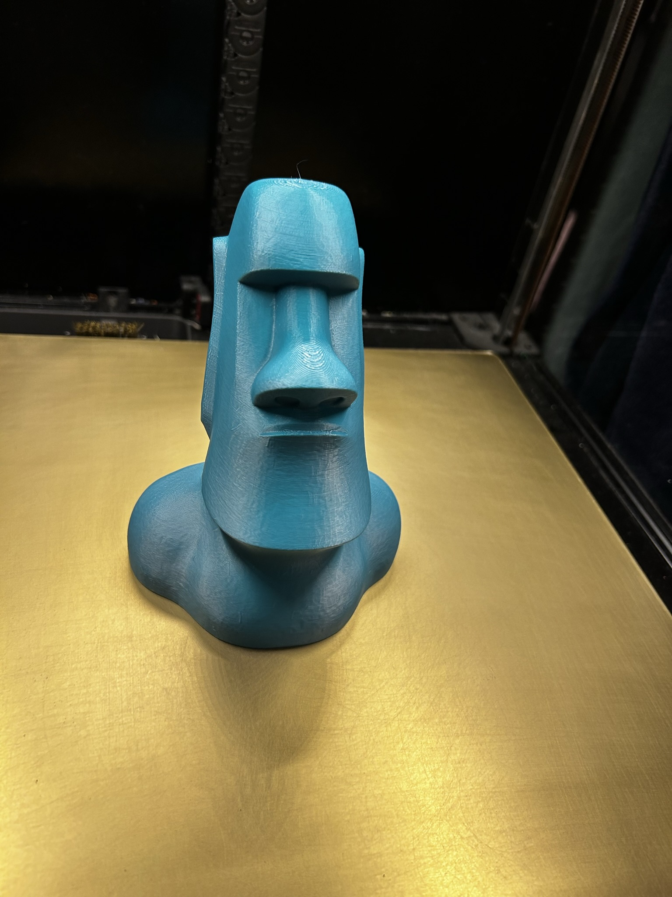
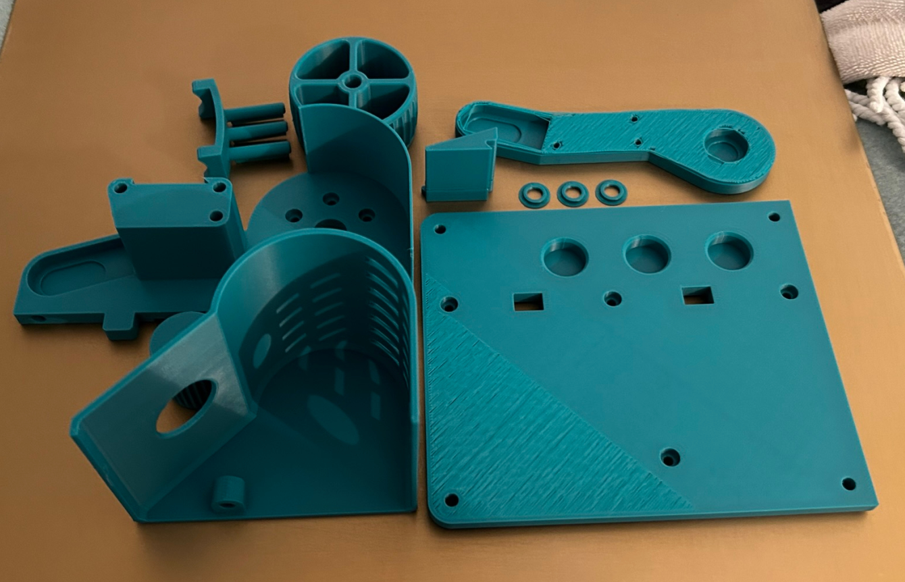
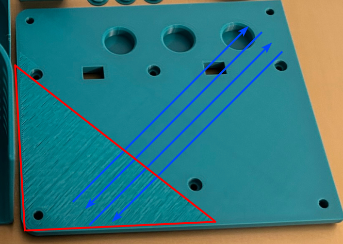
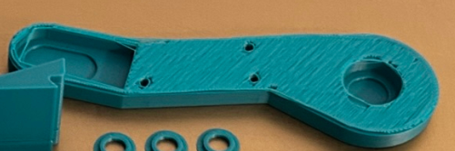
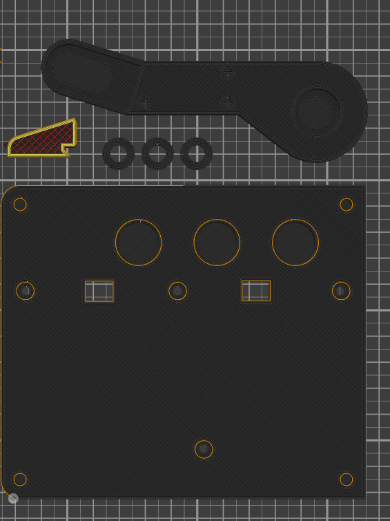
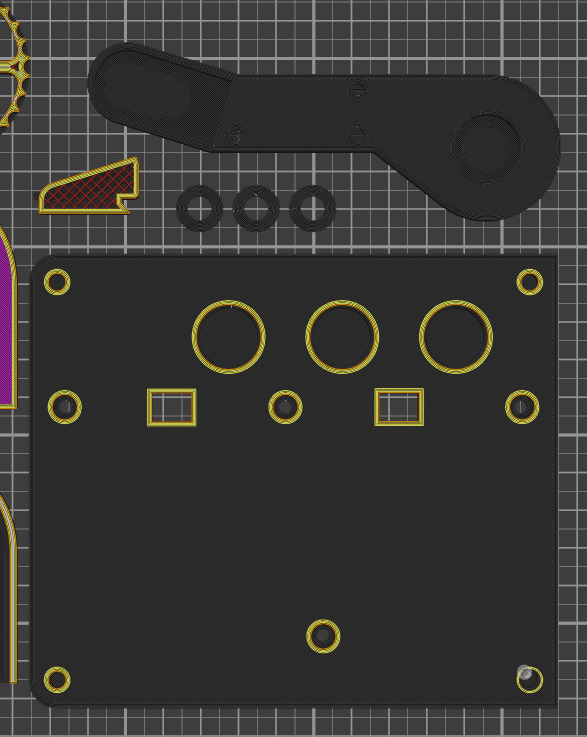
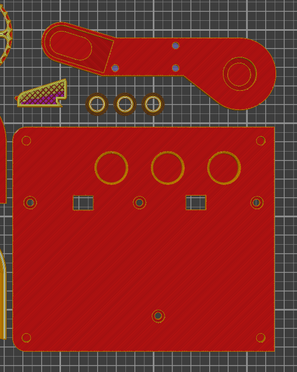
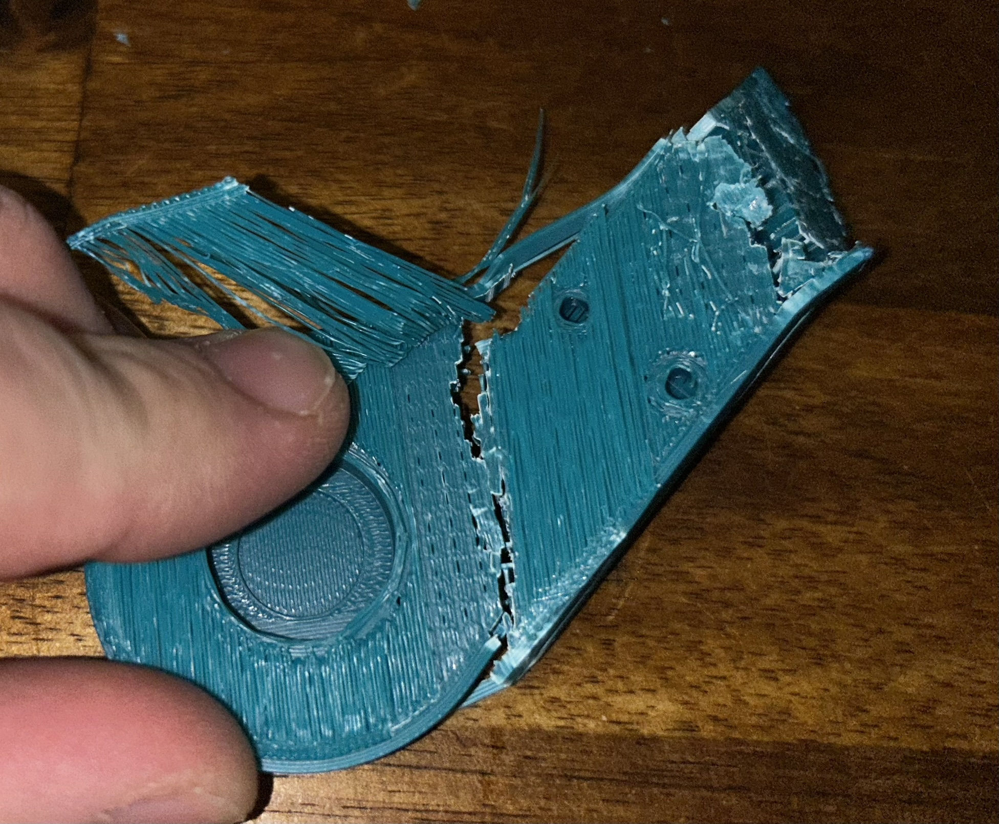

Hey whatsup? I hope y'all are doing good 👋

My printer was actually working quite decent for a good while now. Here one of my last prints for example

`- - - - - - - - - - - - - - - - - - - -` 

## Issue

I have issues with extrusion. Sometimes it just does not work. I can't really tell why but for some reason it seems filament wont be pushed through the toolhead. I don't know what's happening and I don't know what's triggering it.

One time I wanted to start a print and it did not print. It then suddenly started printing the infill while it missed the intro line and perimeters.

The last print just failed completely after the first layer. When I checked the filament it was grinded on. Also some dust on the gears from grinding but not too much. Hotend wasn't clogged though. Print did not recover. There were no plastic plobs laying around from extruding in the air or anything. First layer looked quite decent too. I think it actually failed right after the first layer. Not even printing a little of layer 2.

Sometimes it extrudes but it looks like this. Like ìt's clogging again or so 

`- - - - - - - - - - - - - - - - - - - -` 

One time I tried to print an intro line manually and it didn't extrude anything. I opened the extruder latch, pushed the filament a little to see if the hotend is clogged (it wasn't) and closed the latch again. Tried to print the intro line again and it worked for a while again. 

And then there was this very special print. Never seen something like this before. It took me a while to analyze what happened here.

## Gcode file

Gcode is too big to share in discord so here a goole drive link

https://drive.google.com/file/d/....

`- - - - - - - - - - - - - - - - - - - -`

## The printed plate

`- - - - - - - - - - - - - - - - - - - -` 

## Gcode path

You can see that the gcode moves from top right to bottom left and back. But the "clog-like" spot is in a very distinctive shape in the lower left corner. So the "clog" only happens at the end or at the start of the line. but the rest of the line looks perfectly fine.

`- - - - - - - - - - - - - - - - - - - -` 

## Last part completely failed

The part printed after the part above (and also the last part in gcode) completely failed

`- - - - - - - - - - - - - - - - - - - -` 

## Top layer

Just the gcode I explained above

`- - - - - - - - - - - - - - - - - - - -` 

## The layer below

The layer below the top layer

`- - - - - - - - - - - - - - - - - - - -` 

## Going layers down

Showing all layers going from top to bottom

`- - - - - - - - - - - - - - - - - - - -` 

The other parts on the plate are way taller than the failed prints but they look perfectly fine. Something made the "clog" go away.

But that wasn't a clog. At least not on the top layer. You know how the solid layers are always perpendicular to each other, right?
Layer 1: from bottom left to top right
Layer 2: from top left to bottom right

For some reason the two objects above only printed 3 of 5 solid layers. And it was always the same direction that was printed.  The other direction layers were just completely missing.

## The missing layers

Kinda hard to take a picture of but maybe you can see how the layers are all in the same direction

`- - - - - - - - - - - - - - - - - - - -` 

## What I've tried

- Checked motor crimps: I started like a million extrusions in mainsail and watched the extruder gears spinning while I was wiggling around all kind of cables
- Shortened Bowden Tube: It maybe was a little long and I was thinking maybe the toolhead got stuck somewhere so I shortened the tube.
- Tried different filaments 
- Made sure the filament path isn't obstructed by anything

`- - - - - - - - - - - - - - - - - - - -` 

## Hardware

- Voron 2.4 350mm
- StealthBurner on CW2
- hartk pcb rev3
- TL Dragon SF with Phaetus copper plated 0.4mm nozzle
- Genuine LDO 36STH20-1004AHG 
- Genuine Orion OD4010-24HB (recommended for SB, runs on 23.85v avg)
- AliEx PTFE tube https://...

`- - - - - - - - - - - - - - - - - - - -` 

## Software

- SuperSlicer v2.5.59.0
- Klipper v0.10.0-546
- Moonraker v0.7.1-617
- My Klipper config is on github https://github.com/boop5/voron

`- - - - - - - - - - - - - - - - - -`